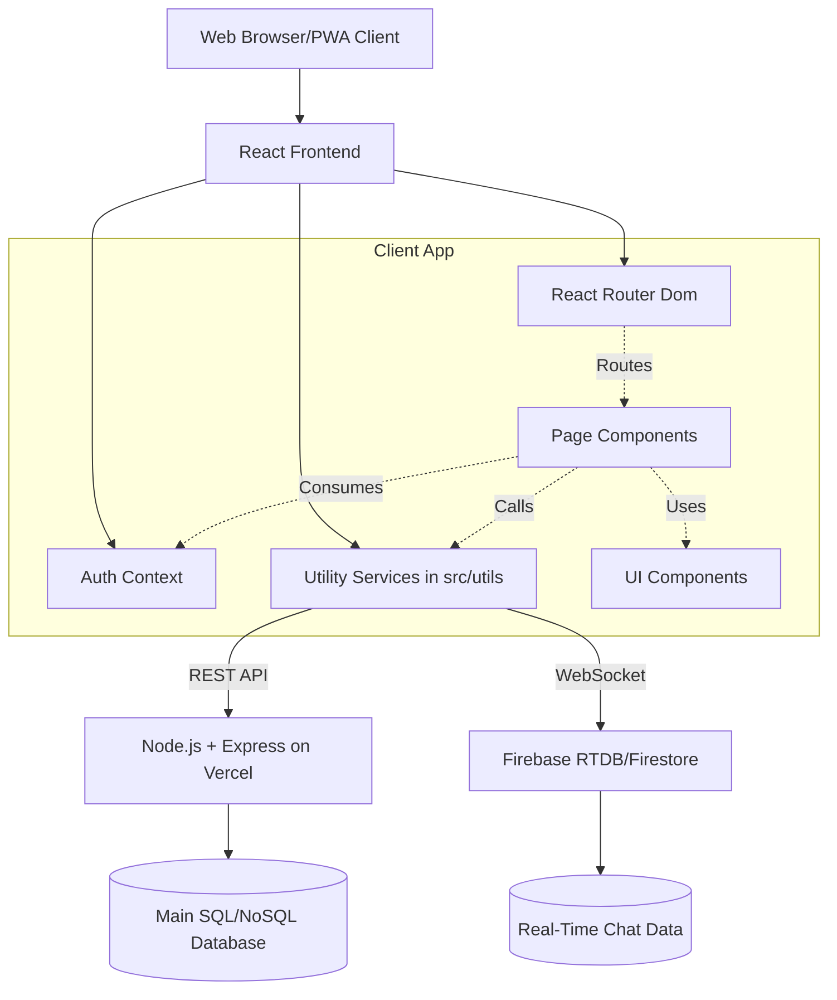

# Architecture Overview

Awaza Web App is a client-side rendered Single Page Application (SPA) designed with a component-driven architecture using React. It communicates over HTTP REST APIs with a custom serverless backend (Node.js + Express on Vercel) for standard data, and utilizes Firebase exclusively for real-time messaging.

## High-Level Architecture

## Core Technologies

| Layer | Technology | Purpose |
| :--- | :--- | :--- |
| **View/UI** | React (19.x) | Core component library for rendering the UI. |
| **Routing** | React Router v7 | Handling client-side page navigation. |
| **Styling** | TailwindCSS | Utility-first CSS framework for rapid styling. |
| **Core Backend** | Node.js + Express | Hosted on Vercel (`https://social-media-app-backend-khaki.vercel.app/`), handling Auth, Posts, Feeds, and User data. |
| **Real-Time Layer**| Firebase | Exclusively used to power the real-time chat features. Chosen over Supabase as a personal preference. |
| **Build Tool** | Vite | Lightning-fast development server and optimized production build. |
| **State Management**| React Context | Global state for Auth; Local state for UI properties. |

## Application Flow

1. **Entry Point:** The app loads via `main.tsx`.
2. **Authentication:** The `AuthProvider` hits the Node.js `/api/auth/me` endpoint to validate the stored JWT token. Until resolved, a loading spinner displays.
3. **Routing:** `AppRoutes` guards protected routes. If unauthenticated, it redirects to `/welcome`. 
4. **Data Fetching:** Utilities in `src/utils/` abstract `axios` calls to the Node.js API, handling error mapping and returning localized Data Transfer Objects to the UI pages.
