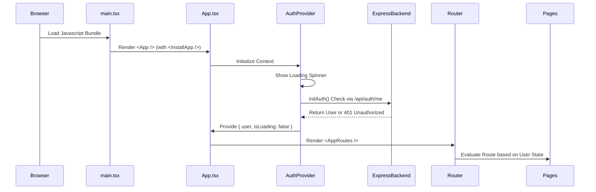
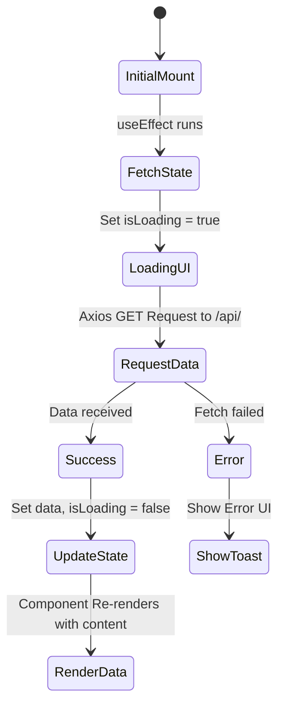

# Rendering Pipeline

This document explains the step-by-step rendering pipeline of the Awaza Web App, covering how the application initializes, how data changes update the view, and how components interact with context and the Express REST APIs.

## Application Initialization

## Component Rendering Lifecycle

React 19 function components use hooks (`useState`, `useEffect`, `useCallback`) to manage the component lifecycle.
When a route changes or internal state is modified:

1. **Trigger:** User interaction, network response, or context update.
2. **Render phase:** React calls the function component to figure out what the UI should look like.
3. **Commit phase:** React applies changes to the DOM.
4. **Effect phase:** `useEffect` hooks fire after formatting the UI to handle side effects (like data fetching from Express).

### Data Loading Pattern

The application heavily utilizes an effect-driven data-fetching pattern:

### Protected Routes Pipeline

Most routes in the application are strictly protected. The pipeline for checking this is highly deterministic:

1. User attempts to navigate to `/home`.
2. Router interprets `<Route path="/home" element={user ? <Home /> : <Navigate to="/welcome" replace />} />`.
3. If the `AuthContext` provides a valid user object, `<Home/>` mounts.
4. If not, the application synchronously replaces the history state and redirects to `/welcome`, bypassing the render of `<Home />`.
